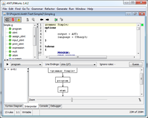

# Знакомство с ANTLR

[ANTLR](http://antlr.org/) (от ANother Tool for Language Recognition – Еще один Инструмент для Распознавания Языков) – это инструментарий для создания компилятор или интерпретаторов языков программирования или DSL (Domain Specific Language – язык специфичный для предметной области), инструментов синтаксического анализа (например, статических анализаторов кода) и других языков инструментов.

Создателем и основным идеологом и разработчиком ANTLR, а также ряда связанных инструментов, таких как [ANTLRWorks](http://antlr.org/works) (среда разработки для ANTLR) или [StringTemplate](http://www.stringtemplate.org/) (библиотека-шаблонизатор, упрощающая разработку трансляторов DSL, которые генерируют не машинный код, а программу на другом языке), является профессор в области компьютерных наук университета Сан-Франциско [Теренс Парр (Terence Parr)](http://www.cs.usfca.edu/~parrt/). 

ANTLR является Open Source продуктом и распространяется по лицензии BSD, что позволяет использовать его как в открытых, так и закрытых коммерческих проектах.

## Обзор ANTLR
В первом приближении, ANTLR представляет собой набор, состоящий из двух частей:
- **генератора анализаторов** – приложения, которое получает на вход описание грамматики в нотации [EBNF](http://en.wikipedia.org/wiki/Extended_Backus_Naur_Form) (Extended Backus–Naur Form – расширенная форма Бэкуса-Наура) и генерирует код для лексического и синтаксического анализатора.
- **runtime-библиотеки**, которая используется для создания конечной программы. Эта библиотека содержит базовые классы для анализаторов, а также классы, управляющие потоками символов и токенов, обрабатывающие ошибки разбора, генерирующие выходной код на основе шаблонов и многое другое.

ANTLR реализует стратегию нисходящего анализа с использованием ограниченного (LL(k)-анализ) или неограниченного (LL(*)-анализ) предпросмотра входной строки.

Сам генератор ANTLR написан на языке Java, однако он умеет генерировать анализаторы для многих других языков и сред, например С/C++, С#, JavaScript, Perl, Ruby, …. Для всех этих языков (называемых «целевыми» – target languages) имеются портированные версии runtime-библиотеки.

В дополнение к перечисленным инструментом, для ANTLR существует специализированная среда разработки **ANTLTWorks**, которая позволяет редактировать (с подсветкой синтаксиса и подстановки кода) и отлаживать грамматики.

## Применение ANTLR

Вот несколько наиболее типичных сценариев использования ANTLR:
- разработка статических анализаторов программ (т.е. анализаторов, которые работают с исходным кодом). Это могут быть, например, средства поиска семантических ошибок (например, как [VCC](http://vcc.codeplex.com/)) или средства, следящие за соблюдением правил написания кода, принятых в компании (например, как [StyleCop](http://code.msdn.microsoft.com/sourceanalysis))
- разработка модулей разбора (frontend) для компиляторов или интерпретаторов
- разработка трансляторов DSL, которые генерируют код на каком-либо языке высокого уровня
- разработка «трансформаторов» - программ, которые, как и компиляторы разбирают текст на исходном языке программирования, но в результате выдают не машинный код, а тот же исходный текст, но слегка модифицированный (например, переформатированный код или код снабженный заготовками для комментариев, к методам – с уже проанализированными параметрами и возвращаемым результатом)

## Полезные ссылки и материалы

Далее приводится небольшая подборка дополнительных материалов, которые могут помочь в изучении ANTLR:
- основной сайт программы http://www.antlr.org/. На нем наиболее полезными могут оказаться следующие разделы:
    - [документации](http://www.antlr.org/wiki/display/ANTLR3/ANTLR+v3+documentation) – содержит краткое руководство по грамматике, параметрах командной строки, особенностях отдельных runtime-библиотек, и т.д.
    - [для скачивания](http://www.antlr.org/download.html) – здесь можно скачать последние версии ANTLR и ANTLRWorks, включая исходные коды.
    - [с готовыми примерами грамматик](http://www.antlr.org/grammar/list) для различных языков. Правда качество разных грамматик также различно.
- книга, посвященная ANTLR: [The Definitive ANTLR Reference: Building Domain-Specific Languages](http://www.pragprog.com/titles/tpantlr/the-definitive-antlr-reference) by Terence Parr. Это наиболее полное руководство по ANTLR, включающее не только руководство по всему функционалу, но и ряд полнофункциональных примеров. Единственный недостаток, на момент издания книги (2007 год) была выпущена только версия 3.1 и часть функционала, появившаяся позднее, в книгу не вошла.
- [краткое пособие по ANTLR](http://jnb.ociweb.com/jnb/jnbJun2008.html), сделанное сторонними авторами.
- сайт библиотеки StringTemplate (http://www.stringtemplate.org/), которая хоть и не является необходимой частью ANTLR, однако тесно с ним интегрирована.

