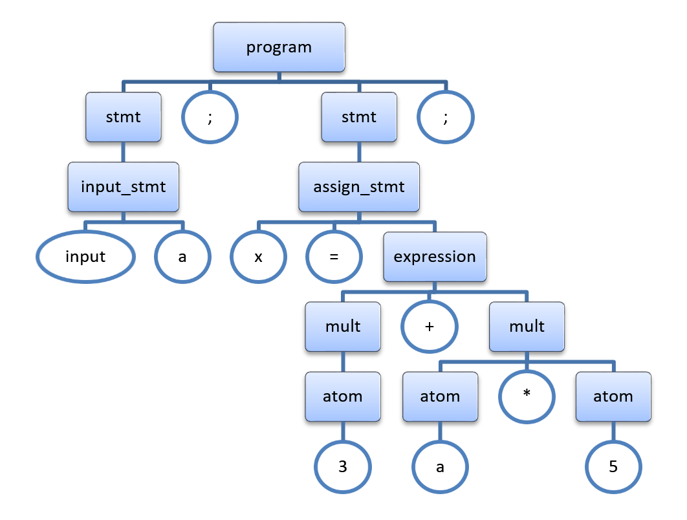
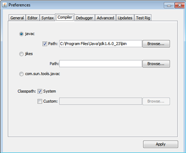
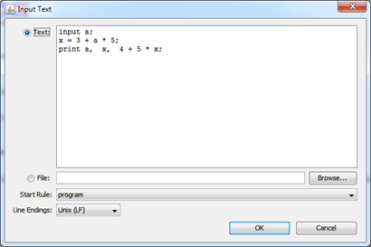
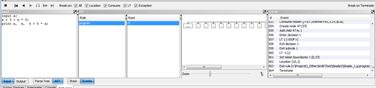
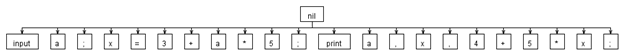
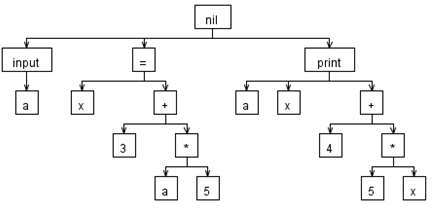

# Введение в абстрактные синтаксические деревья (AST) 

Предыдущий пример, использующий для генерации действия и атрибуты, обладает рядом весьма существенных недостатков:
- **смешение декларативного (описание грамматики) и императивного (сам действия) кода**. Такой код довольно сложно поддерживать и отлаживать. Мало того, смешиваются сразу несколько фаз: разбор и компиляция – что еще более усугубляет проблему поддержки кода.
- **работа только с текущей разобранной частью**. Как следствие, нет простой возможности выполнить обработку результатов анализа в несколько проходов (например, сначала собрать информацию обо всех переменных и их области видимости, а затем сгенерировать исполнимый код) – приходится усложнять код генерации или так видоизменять язык, чтобы все информацию можно было получить и обработать за один проход

Для решения означенной проблемы давно и успешно применяют двухстадийную компиляцию:
- разбор исходного языка и сохранение результата в виде некоего, удобного для дальнейшей работы промежуточного представления
- выполнение стадии построения (которая может включать не только получение исполнимого кода, но и всевозможные оптимизации) на базе промежуточного представления

Способов промежуточного представления придумано множество. Есть линейные (например, трехадресный код), а есть графовые (синтаксические деревья, графы потоков контроля). Последние, конкретно абстрактные синтаксические деревья в последнее время стали одними из наиболее популярных методик промежуточного представления.

## Синтаксические и абстрактные синтаксические деревья
Синтаксическим деревом, а точнее **деревом разбора** называется дерево, структура которого повторяет процесс сопоставления исходного текста и грамматики. Такие деревья обычно записывают следующим образом:
- внутренние узлы представляют правила грамматики;
- листья представляют токены из исходного текста;
В частности, для нашей исходной грамматики и входного и вот такого исходно текста:
```
input a;
x = 3 + a * 5;
```
Дерево синтаксического разбора будет иметь следующий вид (прямоугольниками выделены правила, окружностями/овалами – токены):
 

Даже беглый анализ показывает, что в нем содержится множество избыточных элементов, например:
- токены «;», которые в линейном тексте разделяли операторы, и были крайне важны при анализе, теперь абсолютно не при деле – операторы и так каждый в своем поддереве;
- правило «stmt», которое мы вводили для удобства записи грамматики, не несет никакой смысловой нагрузки – в каждом поддереве за ним идет правило конкретного оператора;
- у правил «input_stmt» и «assign_stmt» есть токены «input» и «=», которые не добавляют новой информации (мы и так уже знаем, что это за операторы);
- правила «expression», «mult» и «atom» нужны нам только для задания приоритетов операторов (чтобы расположить операторы правильно в дереве), и дополнительной информации также не несут.

Если принять во внимание все указанные замечания, то можно перестроить дерево следующим образом:
 

Дерево стало на много проще для восприятия, но не потеряла никакой значимой информации.

Такое дерево называют **абстрактным синтаксическим деревом** (abstract syntax tree, AST), т.е. дерево, представляющее синтаксис абстрактного (в противовес конкретному) языка – языка содержащего только значимые элементы.

Во многих классических компиляторах компиляторов (например bison) специальных средств для работы с AST не предусмотрено – разработчик, если это необходимо строит дерево сам в коде действий (actions). Однако, в ANTLR имеются сразу несколько механизмов для работы с AST, от генерации до обработки.

Начнем как водится с генерации…

## Генерация AST в ANTLR
В ANTLR можно условно выделить три метода генерации AST на основе грамматики разбора («условно»,  потому что эти методы можно смешивать):
- конструирование AST по умолчанию
- с использованием операторов конструирования деревьев
- с использованием правил замены (Rewrite Rules)

### Конструирование AST по умолчанию
Для того чтобы включить данный режим не требуется практически никаких действий. Достаточно лишь добавить опцию 

```
options 
{ 
output = AST; 
}
```

Алгоритм генерации такого дерева довольно прост: 
1.	При старте разбора любого правила создается корень нового поддерева. Пустой – т.е. сами правила в дерево не добавляются!!!
2.	Все разобранные токены добавляются как дочерние элементы к этому корню, а для всех встреченных правил вызывается генерация нового поддерева (как в п. 1)
3.	По завершении разбора правила, сформированное им дерево добавляется в качестве поддерева к вышележащему правилу. Если у дерева был пустой корень, то все его дочерние элементы  добавляются непосредственно к родительскому правилу.
По сути, у нас получается, что все токены  будут добавлены к одному корневому узлу. 
Чтобы проверить полученный результат, сделаем следующее:
- настроим отладку грамматики в ANTLRWorks. 
Для этого:
    - скачаем и установим JDK (например, отсюда http://www.oracle.com/technetwork/java/javase/downloads/jdk-6u31-download-1501634.html)
    - запустим ANTLWorks, откроем его настройки (**File\Preferences**) и перейдем на закладку **Compiler**
    - выберем опцию javac и укажем путь к компилятору (это подпапка bin, той папки, куда был установлен JDK)
 
- доработаем грамматику:
    - откроем исходную нашу грамматику (до «заточки» ее под генерацию кода на C#) в ANTLRWorks
    - добавим опцию output = AST (см. выше)
- запустим отладку
    - выберем пункт **Run\Debug**
    - введем текст примера для отладки:
```
input a;
x = 3 + a * 5;
print a, x, 4 + 5 * x;
```
 


-	в нижней части окна переключимся на закладку Debugger, выберем режим показа AST и управляя клавишами отладки просмотрим результат:
 

Наше дерево выглядит так (один общий корень, и привязанные к нему терминалы):
 

Понятно, что работать с таким практически линейным представлением нам неудобно – оно и близко не похоже на пример AST, который мы рассматривали. 

### Конструирование AST с использованием операторов конструирования деревьев
Второй по сложности способ конструирования деревьев состоит в использовании двух специальных операторов «!» и «^». Эти операторы ставятся после терминалов или правил в исходной грамматике и влияют на то, как будет строиться дерево для текущего разбираемого правила:

|Оператор|Описание|
|---|---|
|!|Не добавлять текущий элемент в общее AST|
|\^| Сделать помеченный элемент корнем текущего разбираемого правила. <br>Все остальные элементы в текущем правиле становятся его детьми.|

Если в одном правиле несколько операторов \^, то построение идет следующим образом:
- все элементы до и после первого элемента с оператором «\^» являются его детьми
- как только встречается второй элемент с «\^», то:
    - он становится новым корнем
    - построенное к этому моменту дерево (в этом дереве корень первый элемент с «\») становится первым дочерним элементом в новом дереве
    - все последующие элементы без «\^» становятся детьми нового корня

Вот пример для нашей исходной грамматики:
```
grammar Simple;

options { output = AST; }

public program	: ( stmt ';'!) +	;

stmt : input_stmt | print_stmt | assign_stmt ;

assign_stmt : IDENT '='^ expression ;

print_stmt : 'print'^ expression (','! expression )* ;

input_stmt : 'input'^ IDENT ;

expression : mult ( ('+' | '-')^ mult)* ;

mult : atom (( '*' | '/')^ atom)* ;

atom : IDENT | NUMBER | '('! expression ')'! ;

NUMBER : DIGIT + ;
	
IDENT : (LETTER | '_') (LETTER | '_' | DIGIT)* ;

fragment LETTER 	: 'A'..'Z' | 'a'..'z' ;
	
fragment DIGIT : '0'..'9' ;

WS : ('\t' | '\r'? '\n' | ' ')+ { $channel = HIDDEN; } ;
```

Посмотрим, какое дерево будет выдано для нашего примера:


Получилось очень похоже на то, к чему мы стремились!

### Конструирование AST с использованием правил замены (Rewrite Rules)
Операторы конструирования дают уже вполне приличный результат, однако, у них есть ряд ограничений:
- они могут манипулировать только токенами, которые есть в самом правиле (т.е. не могут добавить новые)
- они не могут менять порядок токенов

Для нашей задачи, как видно из предыдущего примера, это не существенно, но для более сложных языков может быть серьезным ограничением. Для обхода этих ограничений ANTLR предлагает еще один механизм – **правила замены (rewrite rules)**.

В самом общем виде правила замены имеют следующий синтаксис:
```
<имя_правила_грамматики>: 
          <альтернатива_1> -> <выражение_замены_для_альтернативы_1>
        | <альтернатива_2> -> <выражение_замены_для_альтернативы_2> 
        ...
        | <альтернатива_N> -> <выражение_замены_для_альтернативы_N> 
        ;
```
Выражения замен описывают вид синтаксического дерево, которое оно примет, если сработает альтернатива. Сама нотация для описания деревьев имеет вид:
```
^(root child1 child2 ... childN)
```
Первый элемент внутри скобок – корень, каждый следующий – его потомок. При этом любой из элементов (кроме корня), может быть как конечным элементом, так и новым поддеревом. В последнем случае синтаксис у поддерева такой же, как у самого дерева.

В качестве демонстрации приведем пример дерева, которое получилось в предыдущем пункте:

```
^(nil ^(input a) ^(= x ^(+ 3 ^(* a 5)) ^(print a x ^(+ 4 ^(* 5 x))))
```

Вот несколько примеров правил замены:
1.	Удаление ненужных токенов:
```
atom : '(' expression ')' -> expression;
```
2.	Переупорядочивание токенов (и удаление лишних)
```
decl : 'var' ID ':' type -> type ID ;
```
3.	Создание поддерева с заранее неизвестным количеством узлов:
```
list : ID (',' ID)* -> ID+ ;
decl : 'int' ID (',' ID)* -> ^('int' ID+) ;
```
Одной из интересных и удобных особенностей правил замены является возможность использования так называемых **мнимых узлов** (imaginary nodes). Мнимые узлы – это просто именованные константы, которые можно использовать взамен токенов, которые встречаются в исходном языке.

Например, вместо того, чтобы использовать в AST строку ‘print’ (ключевое слова оператора печати), можно ввести константу STMT_PRINT. В результате мы уменьшим вероятность ошибки (если слово ‘print’ встречается многократно, то однажды при его наборе мы можем просто ошибиться).

Наша конечная грамматика может теперь выглядеть так:
```
grammar Simple;
options { output = AST; }

tokens { 	PROGRAM; STMT_ASSIGN; STMT_PRINT; STMT_INPUT; 
PLUS = '+'; MINUS = '-'; MUL = '*'; DIV = '/'; }

public program	: (stmt ';') + -> ^(PROGRAM stmt+);
	
stmt	: input_stmt | print_stmt | assign_stmt	;

assign_stmt : IDENT '=' expression -> ^(STMT_ASSIGN IDENT expression);

input_stmt : 'input' IDENT -> ^(STMT_INPUT IDENT);

print_stmt : 'print' expression (',' expression )* -> ^(STMT_PRINT expression *)	;

expression : mult ( (PLUS | MINUS )^ mult)* ;

mult : atom (( MUL | DIV)^ atom)* ;

atom : 	IDENT | NUMBER 
	| '(' expression ')' -> expression ;

NUMBER : DIGIT +	;
	
IDENT : (LETTER | '_') (LETTER | '_' | DIGIT)* ;

fragment LETTER 	: 'A'..'Z' | 'a'..'z' ;
	
fragment DIGIT : '0'..'9' ;

WS : ('\t' | '\r'? '\n' | ' ')+ { $channel = Hidden; };
```

## Обработка AST
Как уже говорилось ранее, одна из задач создания AST – упрощение обработки результатов. В чем же заключается это упрощение?

Основная идея состоит в том, что после построения дерева мы знаем все типы входящих в дерево узлов: каково содержание корневых и дочерних элементов (ведь мы явно задавали правила формирования дерева!).

Например (следуя нашей предыдущей грамматике) мы знаем, что:
- узел «программа» содержит некоторое количество (от одного) детей, каждый из которых:
    - либо оператор присваивания
	- либо оператор ввода
	- либо оператор вывода
- узел «оператор присваивания» содержит ровна 2 потомка:
    - имя переменной куда присвоить
	- выражение которое нужно присвоить
- узел «оператор ввода» содержит 1 потомка:
    - переменную куда присвоить введенное значение
- …
- 
Думаю, идея обработки в целом вырисовывается:
- мы пишем процедуры, каждая из которых обрабатывает (обходит) свой тип узла
- процедура может вызывать другие процедуры для обработки своих потомков (в зависимости от типа каждого), агрегировать и обрабатывать результат обхода всего поддерева
 
Осталось понять, какое программное API для доступа к готовым AST предоставляет ANTLR. Здесь все довольно прозрачно:
- все узлы дерева это экземпляры класса **CommonTree**, который реализует интерфейс **ITree**
- интерфейс ITree в частности включает такие свойства как:
    - **ChildCount** – число детей
    - **Children** – полный список детей
    - **Type** – число, которое описывает токен, который является корнем в этом дереве.

Тут следует оговориться, что каждому использованному в грамматике токену ANTLR присваивает некий внутренний числовой идентификатор.

К сожалению, если мы не используем мнимые узлы, то данное значение нам практически бесполезно (т.к. никто не гарантирует, какие именно числа будут присвоены обычным токенам). Однако, в случае мнимых узлов – мы вполне можем ими воспользоваться.

- чтобы получить доступ к корневому узлу всего разобранного дерева:
    - запустить разбор обычно, т.е. вызвав стартовый метод парсера
    - сохранить результат, который вернет этот метод (скорее всего это будет класс **AstParserRuleReturnScope** или его потомок)
    - обратиться к свойству Tree данного класса

В качестве примера рассмотрим «обходчик», который просто по-русски интерпретирует встреченные им узлы:
```
namespace Sample3
{
    using System;
    using System.Linq;
 
    using Antlr.Runtime.Tree;
 
    class PrintASTVisitor 
    {
        public void visitProgram(CommonTree tree)
        {
            foreach (CommonTree node in tree.Children.OfType<CommonTree>())
            {
                switch (node.Type)
                { 
                    case SimpleParser.STMT_ASSIGN:
                        this.visitAssignStatement(node);
                        break;
 
                    case SimpleParser.STMT_INPUT:
                        this.visitInputStatement(node);
                        break;
 
                    case SimpleParser.STMT_PRINT:
                        this.visitPrintStatement(node);
                        break;
 
                    default:
                        Console.WriteLine("Error in PROGRAM node!");
                        break;
                }
            }
        }
 
        void visitAssignStatement(CommonTree tree)
        {
            var variable = tree.GetChild(0) as CommonTree;
            var expression = tree.GetChild(1) as CommonTree;
 
            Console.WriteLine("Присваиваем переменной " + variable.Token.Text + 
                " выражение " + this.visitExpression(expression));
        }
 
        void visitPrintStatement(CommonTree tree)
        {
            string allExpressions = string.Empty;
 
            foreach (CommonTree node in tree.Children.OfType<CommonTree>())
            {
                allExpressions += this.visitExpression(node) + " ";
            }
 
            Console.WriteLine("Печатаем значения " + allExpressions);
        }
 
        void visitInputStatement(CommonTree tree)
        {
            Console.WriteLine("Вводим значение переменной " + 
		(tree.GetChild(0) as CommonTree).Token.Text);
        }
 
        string visitExpression(CommonTree tree)
        {
            switch (tree.Type)
            { 
                case SimpleParser.PLUS: 
                case SimpleParser.MINUS:
                case SimpleParser.MUL:
                case SimpleParser.DIV:
                    var leftExp = tree.GetChild(0) as CommonTree;
                    var rightExp = tree.GetChild(1) as CommonTree;
 
                    return "(" + this.visitExpression(leftExp) + tree.Token.Text + 
		this.visitExpression(rightExp) + ")";
 
                case SimpleParser.NUMBER:
                case SimpleParser.IDENT:
                    return tree.Token.Text;
 
                default:
                    return string.Empty;
            }
        }
    }
}
```

А вот как выглядит его вызов:
```
using Antlr.Runtime;
using Antlr.Runtime.Tree;
 
namespace Sample3
{
    class Program
    {
        static void Main(string[] args)
        {
            var inStream = new Antlr.Runtime.ANTLRFileStream(args[0]);
            var lexer = new SimpleLexer(inStream);
 
            var tokenStream = new CommonTokenStream(lexer);
            var parser = new SimpleParser(tokenStream);
 
            var tree = parser.program().Tree as CommonTree;
 
            var visitor = new PrintASTVisitor();
            visitor.visitProgram(tree);
 
        }
    }
 
}
```
