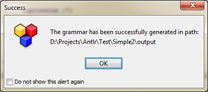
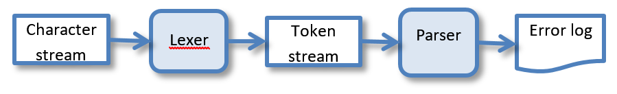
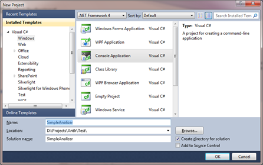
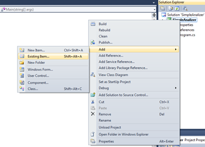
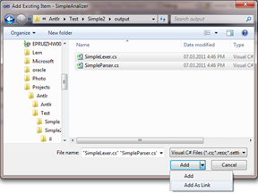
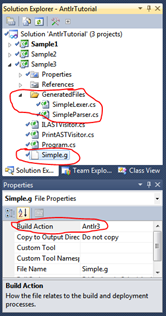

# Анализатор языка на .Net (C#)

Теперь, когда первая работающая грамматика получена, можно переходить к следующей задаче – создать на ее основе законченную программу, распознающую входящий текст.

## Доработка грамматики и генерация
### Генерация

Чтобы сгенерировать код классов лексического и синтаксического анализаторов можно воспользоваться одним из следующих способов:
- вызов генерации непосредственно из ANTLRWorks. Для этого выбрать пункт **Generate\Generate Code**. В случае, если генерация пройдет успешно появится соответствующе сообщение:



При этом надо иметь в виду, что результаты генерации сохраняются в папку, которая указана в настройках ANTLRWorks (меню **File\Preferences**, закладка **General**, поле **Output Path**) 

- генерация из командной строки. Если используется порт ANTLR на .Net, то для генерации можно воспользоваться командой:
```
<путь к папке с Antlr>\Antlr3.exe -o <выходная директория> <файл грамматики>
```

Если воспользоваться первым способом, то в выходном каталоге будут созданы файлы с именами:
```
<имя грамматики>Lexer.java
<имя грамматики>Parser.java
<имя грамматики>.tokens
```
если вторым, то:
```
<имя грамматики>Lexer.cs
<имя грамматики>Parser.cs
<имя грамматики>.tokens
```
Такое различие обусловлено, тем что если в грамматике нет явного указания на каком языке генерировать исходный код для анализаторов, то Java-версия ANTLR делает это для языка Java, а .Net-порт – для С#.

### Указание целевого языка
Чтобы указать ANTLR для какого языка следует генерировать исходные тексты лексического и синтаксического анализатора, необходимо в текст грамматики добавить раздел опций с опцией **language**.
Опции в грамматике задаются сразу за заголовком перед всеми остальными частями и имеют следующий синтаксис:

```
options { <имя опции 1> = <значение опции 1>;  <имя опции 2> = <значение опции 2>; ... }
```

Полный перечень поддерживаемых опций можно найти в разделе [Grammar options](http://www.antlr.org/wiki/display/ANTLR3/Grammar+options). Нас пока интересует только опция **language**, которая задает, на каком языке необходимо сгенерировать тексты для лексического и синтаксического анализаторов. 

**Список известных авторам ANTLR целевых языков приведен на странице [Code Generation Targets](http://www.antlr.org/wiki/display/ANTLR3/Code+Generation+Targets), правда этот список уже слегка устарел и включает даже не все языки, поддерживаемые ANTLR стандартно.**

Для явного указания в качестве целевого языка C# нужно добавить строку:

```
options { language = CSharp3; } 
```

Однако, указанная реализация целевого языка (именно реализация CSharp3, для, Java это не применимо) имеет одну важную особенность по сравнению с другими: синтаксические правила, которые будут вызываться кодом извне должны быть явно указаны с атрибутом public. 

Более подробно назначение этого атрибута будет рассказано позднее, а здесь приведен код грамматики, полученный после описанных изменений (сами изменения выделены полужирным):

```
grammar Simple;
options { language = CSharp3; }

public
program	: ( stmt ';') +	;

stmt : input_stmt | print_stmt | assign_stmt ;

assign_stmt : IDENT '=' expression ;

print_stmt : 'print' expression (',' expression )* ;

input_stmt : 'input' IDENT ;

expression : mult ( ('+' | '-') mult)* ;

mult : atom (( '*' | '/') atom)* ;

atom : IDENT | NUMBER | '(' expression ')' ;

NUMBER : DIGIT + ;
    
IDENT : (LETTER | '_') (LETTER | '_' | DIGIT)* ;

fragment LETTER 	: 'A'..'Z' | 'a'..'z' ;
    
fragment DIGIT : '0'..'9' ;

WS : ('\t' | '\r'? '\n' | ' ')+ { $channel = HIDDEN; } ;

```

После внесения этих изменений необходимо заново сгенерировать код лексера и парсера.

## Первая программа-анализатор на базе ANTLR
Наша первая программа с использованием, сгенерированных ANTLR-ом классов будет только проверять корректность введенного текста.

Прежде чем приступать к разработке собственно программы, обсудим, из каких элементов будет состоять последовательность обработки текста в нашей программе. По большому счету мы реализуем усеченный вариант [Вариант 2. Генерация выхода из действий (семантических правил, actions) в синтаксическом анализаторе](../begin#var2). Основное отличие: у нас не будет генерироваться никаких выходных артефактов, только проверка.

Таким образом, наша программа должна включать:
- входящий поток символов (вводимый из файла, с консоли, и т.д.)
- лексический анализатор, разбивающий поток на последовательность токенов
- хранение и передачу потока токенов от лексического анализатора к синтаксическому
- синтаксический анализатор
- печать сообщений о найденных при разборе ошибках
Т.е. схема работы нашей программы можно представить следующим образом:



### Разработка программы в Visual Studio
Для создания программы по приведенной выше схеме выполним следующие действия:
1.	Создание консольного проекта C# в Visual Studio. Для этого: 
    a. выбрать пункт меню **File\New\Project…**
    b. в окне новых проектов выбрать раздел **Visual C#\Windows**, а в нем пункт Console Application
    c. выбрать место создания проекта, его имя (например, SimpleAnalizer),версию .Net Framework (нам подойдет любой, начиная с 3-го).

 

2.	Добавление в проект сгенерированных ANTLR-ом классов.
    a.	В окне Solution Explorer щелкнуть правой кнопкой на имя проекта, выбрать **Add\Existing Item…** 
 
     b. В открывшемся окне выбрать необходимые файлы (SimpleLexer.cs и SimpleParser.cs), на кнопке **Add** выбрать выпадающий пункт **Add As Link**
 

В принципе, можно выбрать и вариант Add – в этом случае оба файла будут скопированы в каталог проекта. Это удобно, когда проект нужно куда-то передавать, но не очень удобно, если добавленные файлы будут часто меняться извне (как в нашем случае) – их придется обновлять вручную каждый раз после изменения.

3.	Подключить к проекту библиотеку Antlr3.Runtime.dll
4.	Заменим содержимое файла Program.cs на следующее:

```
using System;
using Antlr.Runtime;

namespace SimpleAnalizer
{
    class Program
    {
        static void Main(string[] args)
        {
            // Строка с текстом программы - чтобы не связываться с вводом-выводом
            string inputString = "a = 3 + 4; input b; print a + 1, b * 3;";

            /* Создаем цепочку обработки входящей строки
             * - входящий поток, читающий из заранее предопределенной строки
             * - лексический анализатор, подключенный к входному потоку
             * - поток токенов, связанный с ранее созданным лексическим анализатором
             * - синтаксический анализатор, работающий с созданным ранее потоком токенов
             */
            ANTLRStringStream inputSteam = new ANTLRStringStream(inputString);
            SimpleLexer lexer = new SimpleLexer(inputSteam);
            CommonTokenStream tokenStream = new CommonTokenStream(lexer);
            SimpleParser parser = new SimpleParser(tokenStream);

            // Создаем и подключаем буфер сбора ошибок разбора
            System.IO.StringWriter logBuffer = new System.IO.StringWriter();
            parser.TraceDestination = logBuffer;

            // Вызываем разбор правила program
            parser.program();

            // Анализируем результаты разбора. Если были синтаксические ошибки, выдадим лог анализа
            if (parser.NumberOfSyntaxErrors != 0)
            {
                Console.WriteLine(logBuffer.ToString());
            }
            else
            {
                Console.WriteLine("All ok!");
            }
        }
    }
}
```

Если теперь запустить представленную программу, то в результате на консоли появится сообщение **«All ok!»**, т.к. текст программы, записанный в переменную **inputString** – корректный. Однако, если его заменить, например, на:

```
string inputString = "a = 3 + 4; input b =; print a + 1, b * 3;";
```

то в результате будет выдано сообщение:

```
line 1:20 extraneous input '=' expecting ';'
```

### Разработка программы в Visual Studio с использованием компонент от Sam Harwell
Чтобы максимально перенести разработку в Visual Studio, выполним следующие действия (их, к сожалению, придется выполнять для каждого проекта):
1.	Создадим новый консольный проект (см. раздел выше)
2.	В папке solution-а создадим подпапку Resources\Antlr, куда скопируем содержимое архива **antlr-dotnet-tool-<номер версии>.7z**
3.	Файл Antlr3.targets заменим на прилагаемый к пособию (оригинальный файл при компиляции создает сгенерированные файлы в папке bin\Debug или bin\Release проекта, а это не удобно для использования в студии).
4.	Выгрузим и откроем на редактирование файл проекта. Для этого:
    a.	щелкнем мышью на узле проекта и выберем пункт **Unload Project**.
    b.	повторно щелкнем на узле (уже выгруженного проекта) и выберем пункт **Edit <имя файла проекта>**
5.	В открытом файле проекта найдем строку: 

```
 <Import Project="$(MSBuildToolsPath)\Microsoft.CSharp.targets" />
 ```
и вставим вслед за ней:
```
  <PropertyGroup>
    <AntlrBuildTaskPath>$(ProjectDir)..\Resources\Antlr\</AntlrBuildTaskPath>
    <AntlrToolPath>$(ProjectDir)..\Resources\Antlr\Antlr3.exe</AntlrToolPath>
    <AntlrGenCodeFilePath>$(ProjectDir)GeneratedFiles\</AntlrGenCodeFilePath>
  </PropertyGroup>
  <Import Project="$(ProjectDir)..\Resources\Antlr\Antlr3.targets" />
```

6.	Еще раз щелкнем на узле проекта и выберем пункт **Reload project**.
7.	 Добавим в проект (не ссылкой, а как существующий элемент) файл грамматики Simple.g
8.	В свойствах файла в строке **Build Action** выберем вариант **Antlr3**
9.	В раздел References добавим сборку Antlr3.Runtime.dll (она лежит в папке солюшена, в Resources\Antlr)
10.	Скомпилируем 1 раз проект. 
a.	При этом в папке проекта создастся подпапка GeneratedFiles, содержащая все файлы, сгенерированные Antlr.
11.	Добавим в проект все .cs файлы из этой папки, но **как ссылки** (см. предыдущий раздел).
a.	В проекте появится папка GeneratedFiles, содержащая наши сгенерированные лексер и парсер.
12.	Поменяем файл Program.cs аналогично предыдущему пункту.



## Сгенерированные анализаторы
// TODO Рассмотрим более подробно, что получается в результате работы ANTLR
