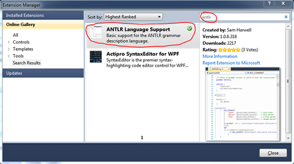
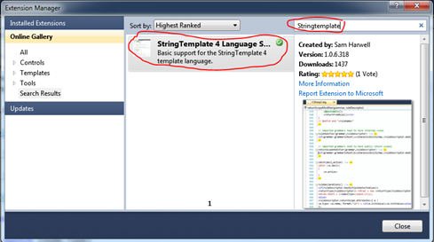
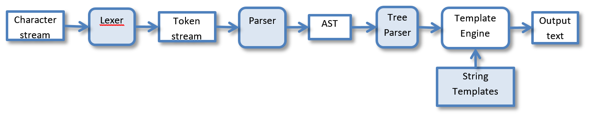
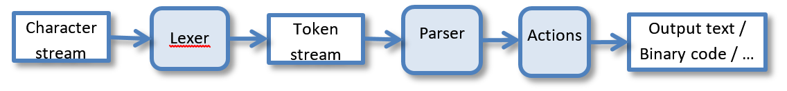
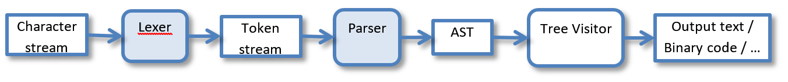

# Начало работы
Прежде чем переходить непосредственно к изучению и работе с ANTLR, мы кратко опишем задачу, на базе которой будем изучать этот инструмент. В качестве таковой мы возьмем создание компилятора для простейшего языка программирования.

Наш язык будет поддерживать три оператора: присваивания, ввода и печати. Пример программы на таком языке объяснит все без комментариев

```basic
input a;
x = 3 + a * 5;
print a,  x,  4 + 5 * x;
```

На выходе наш компилятор будет генерировать код на языке IL (Intermediation Language) – промежуточном языке платформы .Net. Например, для приведенной выше программы должен будет сгенерироваться примерно следующий код

```nasm
.assembly Sample {}
.assembly extern mscorlib {}
.method static void main()
{
    .entrypoint
    .maxstack 100
    .locals init (int32 a, int32 x)
    
    call string [mscorlib]System.Console::ReadLine()
    call int32 [mscorlib]System.Int32::Parse(string)
    stloc a
    
    ldc.i4 3
    ldloc a
    ldc.i4 5
    mul
    add
    stloc x
    
    ldloc a
    call void [mscorlib]System.Console::WriteLine(int32)
    
    ldloc x
    call void [mscorlib]System.Console::WriteLine(int32)
    
    ldc.i4 4
    ldc.i4 5
    ldloc x
    mul
    add
    call void [mscorlib]System.Console::WriteLine(int32)
    
    ret
}
```

Такой подход позволяет довольно наглядно наблюдать за результатом компиляции. Сам наш компилятор будет также предназначен для платформы .Net и написан на языке C#.

Но прежде чем начать работу, необходимо:
- подготовить инструменты и окружение
- познакомиться с основными используемыми в ANTLR

## Подготовка к работе
Для работы нам понадобятся:
1.	сам ANTLR и среда ANTLRWorks
2.	Java-runtime (для работы ANTLR), и опционально JavaSDK (для отладки грамматик)
3.	.Net Framework (можно использовать любой, начиная с версии 2.0)
4.	runtime-библиотеку ANTLR для .Net 
5.	Visual Studio (можно версию Express), или любая другая среда разработки под .Net (например, SharpDevelop)

Пункты 2, 3 и 4, скорее всего не вызовут никаких проблем, а вот по пунктам 1 и 5 нужно дать некоторые пояснения.

### ANTLR и ANTLRWorks
Сам по себе, ANTLR является консольным Java-приложением, которое принимает на вход файлы с описанием грамматик(и), а на выходе генерирует исходные файлы на указанном языке программирования. В принципе, для работы этого уже достаточно, однако для более удобной работы лучше воспользоваться специализированной средой, такой как ANTLRWorks.

Скачать ANTLRWorks можно с её домашней страницы [http://www.antlr3.org/works/index.html](http://www.antlr3.org/works/index.html). ANTLRWorks уже содержит в себе модули ANTLR, а значит, качать его отдельно не нужно.

Если по какой-то причине использовать Java-версию ANTLR нельзя, можно воспользоваться его портом на .Net. Актуальную версию можно найти на странице [https://theantlrguy.atlassian.net/wiki/spaces/ANTLR3/pages/2686980/Antlr3CSharpReleases](https://theantlrguy.atlassian.net/wiki/spaces/ANTLR3/pages/2686980/Antlr3CSharpReleases).  К сожалению, портирован только сам компилятор ANTLR, но не среда. 

### Runtime-библиотека
Второй необходимый компонент для работы с ANTLR, это библиотека runtime-поддержки. Получить .Net-версию этой библиотеки можно одним из следующих путей:

- скачать полный порт ANTLR со страницы [https://theantlrguy.atlassian.net/wiki/spaces/ANTLR3/pages/2686980/Antlr3CSharpReleases](https://theantlrguy.atlassian.net/wiki/spaces/ANTLR3/pages/2686980/Antlr3CSharpReleases). Я рекомендую брать пакет, который помечен как **antlr-dotnet-tool-<номер версии>.7z** – там сразу есть все библиотеки и сам компилятор ANTLR.
- самостоятельно собрать библиотеку из исходных файлов.
Первый вариант на много проще, однако, бинарные сборки обновляются все же реже и не всегда содержат последние актуальные исправления. Поэтому, иногда бывает выгоднее все-таки собрать runtime самому.

Для этого следует:
1.	скачать исходные файлы ANTLR. Это можно сделать, перейдя по ссылке [https://github.com/antlr/antlr3](https://github.com/antlr/antlr3) и нажав кнопку **Download**.
2.	в скаченном архиве найти подпапку **runtime\CSharp3\Sources** 
3.	сгенерировать ключ для подписывания сборок утилитой **sn.exe** (данная утилита входит в состав Windows SDK, который обычно ставится при установке Visual Studio). Сам ключ должен находиться в подпапке **Antlr3.Runtime**
Для генерации можно использовать примерно такую команду (поправить пути):

```
"C:\Program Files\Microsoft SDKs\Windows\v7.0A\bin\sn.exe" -k Antlr3.Runtime\key.snk
```

4.	собрать бинарную версию либо через Visual Studio, либо из командной строки. Например, так:
```
C:\Windows\Microsoft.NET\Framework\v4.0.30319\MSBuild.exe Antlr3.Runtime.sln
```
По большому счету теперь все готово к работе, однако если вы хотите большую часть работы вести в Visual Studio, рекомендую скачать и  установить компоненты интеграции с Visual Studio

### Компоненты интеграции в Visual Studio от Sam Harwell

Самый простой способ установить компоненты, это: 
1.	Открыть Extension Manager. Для этого в Visual Studio выбрать пункт меню **Tools\Extension Manager…**
2.	Выбрать слева раздел **Online Gallery**
3.	Набрать в строке поиска Antlr
 
4.	Установить расширение **ANTLR Language Support**
5.	Повторить 3 и 4 для **stringtemplate**
 
6.	Перезагрузить Visual Studio.

Примечание. Иногда при первой перезагрузке следуют несколько сообщений о невозможности загрузки некоторых пакетов – из-за конфликтов с другими расширениями. После повторной перезагрузки Visual Studio строкой **devenv.exe /ResetSkipPkgs** сообщения пропадают.

## Понятия и подходы работы с ANTLR

В отличие от многих других инструментов создания компиляторов, ANTLR имеет средства для создания не только frontend-части (т.е. лексического и синтаксического анализатора), но и некоторые возможности генерации backend (т.е. генератора кода).

При этом backend может реализовываться весьма по-разному, в зависимости от задач и потребностей. 

### Вариант 1. Использование механизмов анализатора деревьев и шаблонизатора {#var1}
На рисунке ниже приведен самый общий вариант, который задействует практически все механизмы ANTLR:


Основные элементы, присутствующие на рисунке (закрашенные фигуры представляют элементы, которые генерирует ANTLR на основе переданных ему описаний грамматик(и)):

- **Character stream** – входной поток символов, содержащий текст программы на исходном языке
- **Lexer** – лексический анализатор, разбивающий исходный поток символов на отдельные лексемы и выполняющий анализ к какому типу принадлежит данная лексема. На выходе лексический анализатор порождает поток токенов (объектов, содержащих информацию о каждой выделенной лексеме и её типе) 
- **Token stream** – поток токенов.
- **Parser** – синтаксический анализатор. Просматривает поток токенов и анализирует структуру предложений языка. 
- **AST** – абстрактное синтаксическое дерево. AST – это промежуточное представление разобранной программы, удобное для дальнейшего анализа и генерации кода.
- **Tree Parser** – анализатор дерева. Анализатор, используемый для прохода по дереву (в чем-то похож на синтаксический анализатор, но работает не с линейным потоком токенов, а с двухмерной структурой – деревом). Он анализирует структуру и отдельные узлы дерева и вызывает template engine, для генерации выходного текста.
- **Template Engine** – механизм генерации текстов на основе предопределенных шаблонов. Данный механизм формирует выходной текст, составляя его из отдельных фрагментов текста. Каждый такой фрагмент получается на основе заранее определенного шаблона и подставляемых в него параметров
- **String Templates** – шаблоны для генератора вывода (библиотека шаблонов)
- **Output Text** – окончательный текст.

Получается следующая цепочка: поступающая на вход программа разбирается с помощью лексического и синтаксического анализатора, а в результате формируется промежуточное представление программы в виде AST. Затем специальный анализатор деревьев (а их может быть не один – каждый анализатор для своих задач!) проходится по AST и через специальную библиотеку вызывает генерацию выходного текста.

Как видно из описания в данном варианте на входе имеется текст программы, а на выходе – тоже текст (например, на другом языке), т.е. такой вариант в первую очередь предназначен для создания DSL-трансляторов, переводящих программу на DSL, в программу на каком-либо распространенном языке программирования.

Однако, такой подход не единственный, и возможны другие варианты.

### Вариант 2. Генерация выхода из действий (семантических правил, actions) в синтаксическом анализаторе {#var2}

Такой вариант часто встречается в классических учебниках по компиляторам и его поддерживают многие распространённые генераторы компиляторов. В этом варианте действия по генерации результирующего кода встраиваются непосредственно в правила синтаксического анализа. 

Получается вот такой конвейер обработки:


Действия вызываются синтаксическим анализатором, когда он заканчивает разбирать какую-то грамматическую конструкцию или ее часть. Так как действия это код на произвольном (конечно из тех, что поддерживает ANTLR) языке программирования, то в него может быть встроено, все что угодно: анализ и поиск ошибок, генерация текста или бинарного кода, сбор статистики, …

### Вариант 3. Генерация абстрактного синтаксического дерева и его ручной разбор {#var3}
Этот вариант является промежуточным между 1-ым и 2-ым. С одной стороны синтаксический анализатор здесь также генерирует структуру AST, с другой – для анализа этой структуры используется «рукописный» код.



Обычно для написания кода прохода по полученному AST используют подход называемый Tree Visitor (или hierarchy visitor). 

Как и в варианте 2, т.к. код «визитёра» вручную, результатом его выполнения может быть не только текст. 


### Как будем работать мы?
В дальнейшем, в работе над нашим простым компилятором мы будем ориентироваться на вариант №1. Однако, по мере знакомства с ANTLR будут рассмотрены и оба оставшихся варианта. Таким образом, у нас получится сразу 3 реализации одного и того же компилятора.

## Как построить работу с ANTLR?

Примерная схема работы с ANTLR (для варианта 1) может быть представлена так:
1.	Разработка грамматик и отладка их в ANTLRWorks:
a.	разработка грамматик исходного языка (для лексического и синтаксического анализатора)
b.	добавление (по необходимости) действий в правила грамматики
c.	добавление правил генерации AST
2.	Разработка грамматики деревьев и создание шаблонов для генерации выхода
3.	Генерация кода для всех анализаторов
4.	Написание приложения, которое будет вызывать сгенерированные классы
