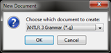
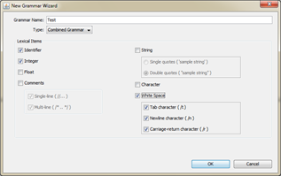
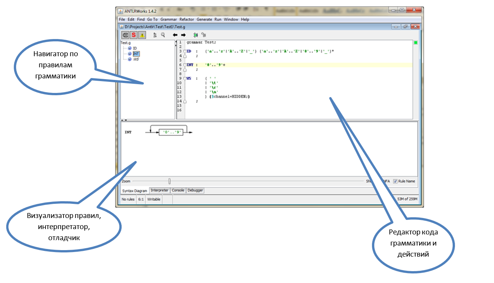
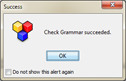
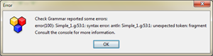
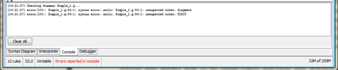
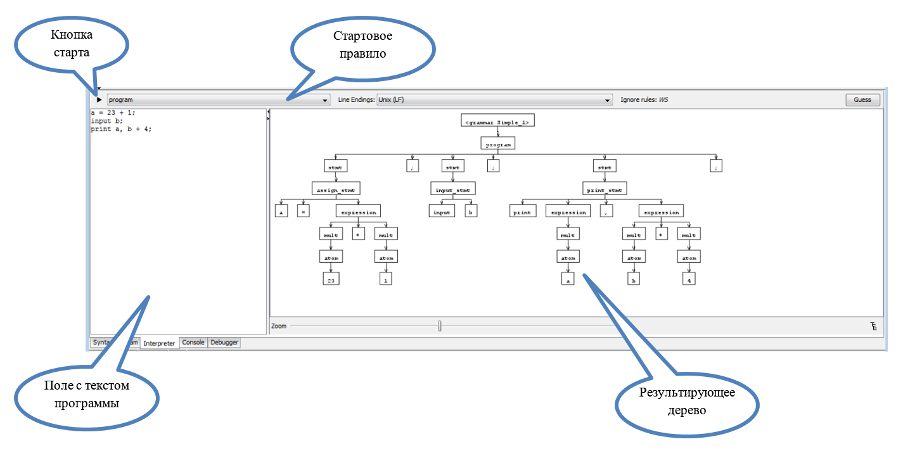

# Задание грамматики

Для создания простого файла грамматики можно воспользоваться мастером, входящим в состав ANTLRWorks.
1.	Запуск ANTLRWorks (файл antlrworks-1.4.2.jar).
2.	Если это первый запуск ANTLRWorks, то мастер создания грамматик запустится автоматически. Если же запуск не первый, необходимо выбрать пункт меню File\New…



3.	В окне New Document выбрать пункт ANTLR 3 Grammar (*.g) (см. рисунок):
  
4.	В окне задания параметров грамматики указать (см. рисунок): 



- имя грамматики (Test)
- тип грамматики (Combined Grammar)
- поставить галочки создания лексических правил для:
  - идентификаторов - Identifier
  - целых чисел – Integer
  - пробелов всех типов – White Space
В результате выполнения этих шагов откроется редактор грамматики ANTLRWorks:



Для нас пока наиболее важным будет окно редактора текстов. 

К уже существующему коду мы добавим еще одно правило, так, чтобы в результате получилась примерно такая картина:

```
grammar Test;

ID	:	('a'..'z'|'A'..'Z'|'_') ('a'..'z'|'A'..'Z'|'0'..'9'|'_')*
	;

INT	:	'0'..'9'+
	;

WS	:	( ' '
		| '\t'
		| '\r'
		| '\n'
		) {$channel=HIDDEN;}
	;
        
prog
	:	(ID ':=' INT ';') +
	;

```

Рассмотрим ее более подробно.

**Более полное и формальное описание грамматики можно найти в документации на сайте ANTLR, в разделе [Grammars](http://www.antlr.org/wiki/display/ANTLR3/Grammars).**


## Основные элементы грамматики
### Заголовок грамматики
Первая строчка – заголовок грамматики. В общем виде он задается следующим образом:

```
[тип_грамматики] grammar <имя_грамматики>;
```

Всего ANTLR поддерживает 4 типа грамматик: 
- **lexer** – задает правила для лексического анализатора
- **parser** – задает правила для синтаксического анализатора
- **tree** – правила для анализатора AST
- **без явного указания** (как в нашем примере) – задает комбинированную (lexer + parser) грамматику

Обычно в работе используют последние две грамматики. Раздельные грамматики для лексического и синтаксического анализатора бывают полезны когда: 
- грамматика слишком большая и с общим файлом работать становится неудобно
- нужно иметь возможность менять лексический блок (например, делать лексические анализаторы с учетом специфики различных ОС) или наоборот использовать один лексический блок с разными с синтаксическими.

**Важно! ANTLR требует, чтобы имя грамматики и файла, в котором она описана совпадали.**

### Строки
Строки (строковые константы) в ANTLR заключаются в одинарные кавычки. Длина не имеет значения, т.е. не различаются «одиночные символы» и «строки».

```
':='
```

Можно использовать escape-последовательности для обозначения специальных символов (большинство из них встречаются в других языках – C++, C#, Java, …):

|Символ|Значение|
|---|---|
|’\n’|	Перевод строки|
|’\r’|	Возврат каретки|
|’\b’|	«Забой»|
|’\f’|	Промотка|
|’\’’|	Символ одинарной кавычки|
|’\\\’|	Символ «наклонная черты»|
|’\uXXXX’|	Символ в Unicode. XXXX – заменяется на шестнадцатеричное представление символа в кодировке Unicode|

### Комментарии
Бывают одно- и многострочные:

```
// однострочный комментарий
```

```
/* многострочный
   комментарий
*/
```

### Идентификаторы
Состоят из букв символов, цифр и символа ‘_’, но начинаются всегда с буквы. Для идентификаторов важен регистр первого символа, т.к. по нему происходит разделение правил на правила для лексического и синтаксического анализатора.

### Правила
Собственно, правила это основной элемент грамматики (что логично ). В самом простом виде синтаксис правил представляет собой конструкцию:

```
[модификатор доступа] 
<имя правила> 
:	<альтернатива 1>
|	<альтернатива 2>
…
|	<альтернатива N>
;
```

Например

```
LETTER	:	'A'
	|	'B'
	|	'C'
	;
```

Все правила в комбинированной грамматике делятся на лексические и синтаксические. 

Лексические правила используются для описания того, как входящий поток символов разбивается на токены, и служат основной для генерации лексического анализатора. Синтаксические описывают правила построения приложений языка и используются для генерации синтаксического анализатора.

Лексические правила (и соответствующие им имена токенов) должны начинаться с заглавной буквы, а синтаксические – со строчной.

Далее приводятся конструкции, которые можно использовать при задании лексических или синтаксических правил:

|Конструкция|Тип анализатора (lexer/parser/any)|Описание|
|---|---|---|
|‘string’|any|Сопоставление с указанной строкой в текущей позиции (строка рассматривается как токен, у которого нет предопределенного имени)|
|’A’..’Z’|lexer|Сопоставление с любым из символов из интервала между ‘A’ и ‘Z’ включительно|
|(’x’..’y’\|’a’\|’b’)|lexer|Сопоставление с любым из символов, перечисленном в выражении|
|T|any|Для синтаксического анализатора – сопоставление с токеном T. Для лексического анализатора – вызов лексического правила T|
|(A\|B\|C)|parser|Сопоставление с одним из токенов|
|r|parser|Вызов на сопоставление правила r|

Кроме  того, ANTLR поддерживает следующие расширения из нотации EBNF, возможные для любых грамматик.

|Оператор (пример использования)|Пояснение|
|---|---|
|( )|Группировка элементов, к которым применяется оператор|
|a \| b \| c |Сопоставление с одной из перечисленных альтернатив|
|x?|Необязательный элемент|
|x*|Сопоставление 0 или более раз|
|x+|Сопоставление 1 или более раз|

Перечисленные операторы можно комбинировать.

Например, выражение 
```
( ‘0’ | ‘1’ )+ 
```
описывает строку из одного или более символов 0 и 1 (двоичное число)

В созданном нами в самом начале файле описаны 4 правила:
- **ID**, **INT**, **WS** – лексические правила, описывающие токены «идентификатор», «целое число» и «пробельный символ»
- **prog** – синтаксическое правило, которое описывают программу как «набор одного или более операторов, состоящих из: 
  - идентификатора, 
  - оператора присваивания ‘:=’ 
  - целого числа 
и завершающихся точкой с запятой»

Отдельного упоминания заслуживает правило WS, в конце которого можно увидеть строку:

```
{$channel=HIDDEN;}
```

Данная строка представляет собой семантическое действие. О семантических действиях будет сказано позднее, здесь же нужно только пояснить, что токену WS присваивается специальный признак (можно читать как тип канала - «скрытый»), который говорит синтаксическому анализатору, что нужно игнорировать токены WS, если они встречаются в потоке токенов.

Благодаря этому приёму нам нет необходимости повсеместно вставлять в наши синтаксические правила упоминания пробельных символов. Например, наше правило prog выросло бы до такого:

```
prog : (ID WS* ':=' WS* INT WS* ';' WS*) + ; 
```

читаемость, которого, явно оставляет желать лучшего.

Еще один полезный механизм, который может пригодиться при разработке лексических анализаторов, это ключевое слово fragment (добавляется перед именем правила), которое указывает, что данное лексическое правило самостоятельно не распознает никаких токенов и может только вызываться из других лексических правил. Например, правило ID из исходного правила можно описать так:

```
ID : (LETTER | '_') (LETTER | '_' | DIGIT)* ;

fragment LETTER 	: 'A'..'Z' | 'a'..'z';
fragment DIGIT : '0'..'9';
```

## Разработка и отладка грамматики для нашего языка
### Разработка грамматики

Вооружившись описанными выше понятиями, опишем грамматику для нашего языка. В комментариях к некоторым правилам идет пояснение, упрощающее их понимание.

```
grammar Simple;

// Программа, это непустая последовательность операторов, заканчивающихся точкой с запятой
program	: ( stmt ';') +	;

// Оператор, это один из трех операторов: ввода, печати или присваивания
stmt : input_stmt | print_stmt | assign_stmt ;

// Оператор присваивания состоит из идентификатора, знака присваивания и выражения
assign_stmt : IDENT '=' expression ;

// Оператор печати состоит из слова print, за которым следуют одно или более выражений, 
// разделённых запятой
print_stmt : 'print' expression (',' expression )* ;

// Оператор ввода состоит из слова input и идентификатора вводимой переменной
input_stmt : 'input' IDENT ;

// Выражение это набор выражений с умножением, разделенных знаками сложения или вычитания
expression : mult ( ('+' | '-') mult)* ;

// Выражение с умножением – это последовательность атомарных единиц, разделенных pyfrfvb
// умножения или деления
mult : atom (( '*' | '/') atom)* ;

atom : IDENT | NUMBER | '(' expression ')' ;

NUMBER : DIGIT + ;
	
IDENT : (LETTER | '_') (LETTER | '_' | DIGIT)* ;

fragment LETTER 	: 'A'..'Z' | 'a'..'z' ;
	
fragment DIGIT : '0'..'9' ;

WS : ('\t' | '\r'? '\n' | ' ')+ { $channel = HIDDEN; } ;
```

### Проверка синтаксиса
После того, как грамматика набрана, можно проверить ее правильность (с точки зрения синтаксиса, но не логики самих правил) непосредственно в ANTLR. Для этого достаточно выбрать пункт меню **Grammar\Check Grammar**. Если проверка прошла успешно, будет выдано сообщение:
 


В противном случае появится сообщение об ошибке:
 


Эту же информацию можно увидеть в консоли, внизу редактора (вкладка Console):


  
### Интерпретация и отладка грамматики
Однако, проверка синтаксиса не гарантирует, что сама грамматика распознает именно те конструкции, которые нужно. Поэтому грамматику бывает полезно проверить на различных входных текстах, а в случае обнаружения ошибок, выяснить, в чем именно они состоят, т.е. локализовать и исправить ошибочные правила. Для этого возможны три пути:
- сгенерировать лексический и синтаксический анализатор, написать программу, их использующую и прогнать программу на различных тестах;
- воспользоваться вкладкой Interpreter в ANTLRWorks;
- воспользоваться возможностями отладки, встроенными в ANTLRWorks

Мы рассмотрим 2 последних, как более простых и наглядных.

#### Интерпретация грамматики  
Интерпретация выполняется встроенными в ANTLRWorks средствами и состоит в построении для указанной грамматики дерева синтаксического разбора. Это дерево показывает: где и какие синтаксические правила применялись, и какие были выделены токены в процессе разбора.

Чтобы запустить интерпретацию, нужно:
- перейти на вкладку Interpreter 
- в самом левом поле ввести текст, который требуется разобрать
- в выпадающем списке над ним выбрать правило, с которого будет начат разбор
- нажать кнопку старта интерпретации

 


Если в процессе разбора произойдет ошибка, то вместо очередного узла будет показан узел с возникшим исключением.

#### Отладка грамматики
// TODO
